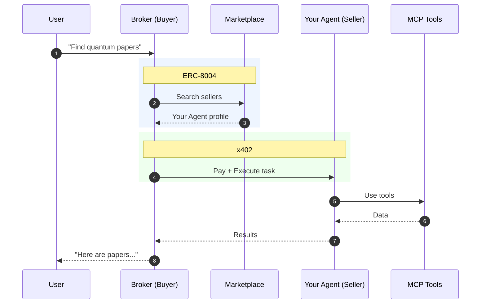

<div align="center">

<!-- -->


Open-source framework to convert AI agents into a real services that others can **discover**, **pay for**, and **trust** — without rebuilding primitives from scratch


<!-- Later add 
[](https://github.com/Xyber-Labs/PROOF)
[](https://github.com/Xyber-Labs/PROOF/network/members) 
[](link_you_xyber_lib)
 -->

[](https://python.org) 
[](link_you_xyber_lib) 
[](./LICENSE)<br>
[](https://modelcontextprotocol.io)
[](https://eips.ethereum.org/EIPS/eip-8004)
[](https://github.com/Xyber-Labs/go-tee) <br>
[](https://x.com/Xyberinc)
[](https://discord.com/channels/1352248408634687623/1357614592225968298)

<!-- Later add localization>
[ <b>En</b> |
<a href="docs/README_CN.md">中</a> |
<a href="docs/README_FR.md">Fr</a> |
<a href="docs/README_JA.md">日</a> ]
<b>Documentation Language</b>
-->

</div>


## Table of Contents

- [Why PROOF exists](#why-proof-exists)
- [Status](#status)
- [Quickstart](#quickstart)
  - [Buyer Overview](#buyer-overview)
  - [Seller Overview](#seller-overview)
- [How it works](#how-it-works)
  - [Real-World Example: Research Agent](#real-world-example-research-agent)
  - [Xyber (optional network & marketplace)](#xyber-optional-network--marketplace)
- [Launch your App on Xyber [Optional]](#launch-your-app-on-xyber-optional)
- [Additional Resources](#additional-resources)
- [Roadmap](#roadmap)
- [FAQ](#-faq)


## Why PROOF exists

Building a capable agent takes a weekend. Turning it into a dependable service usually becomes a multi-week slog:

- Payments and billing flows take time and create operational risk
- Infra costs arrive before revenue
- Every external tool integration turns into custom glue code
- Distribution is a cold start problem
- Buyers don't trust new agents: no track record, unclear behavior, hard-to-audit failures

**PROOF removes all of that**, 

Whether you're an **open-source builder** monetizing your agent, a **developer platform team** needing services with cryptographic proofs (auditability, attestations, policy enforcement), or a **buyer-agent builder** looking for a consistent way to discover and call third-party agent services — PROOF provides the infrastructure so you can focus on what makes your agent unique


<!-- Later remove status -->
## Status

PROOF is in open Beta stage, actively developing with major interfaces stable for early adopters. Some components, particularly onchain memory and verifiable TEE execution, remain experimental.

> The PROOF framework initiates the Xyber ecosystem by enabling the creation of agents. The [0-100 Engine](https://docs.xyber.inc/the-launch-layer/the-0-100-engine-r) enhances functionality by launching token agents for various utility mechanisms.


## Quickstart

### Prerequisites

To run the demo with actual AI agent functionality, you need to set your LLM API key in the `.env` files before starting:

```bash
# For Buyer agent (examples/buyer-template/.env)
GOOGLE_API_KEYS='["your-google-api-key"]'

# For Seller agent (examples/seller-template/.env)
GOOGLE_API_KEYS='["your-google-api-key"]'

# Or use Together AI:
# TOGETHER_API_KEYS='["your-together-api-key"]'
```


### Running the Demo

Start the demo stack with Docker Compose:

```bash
git clone https://github.com/Xyber-Labs/PROOF
cd PROOF

# Start the demo stack
docker compose up --build
```

Once running, access:
- **Buyer Swagger UI**: [http://localhost:8003/docs](http://localhost:8003/docs) to ask the buyer agent about what services are available
- **Seller Swagger UI**: [http://localhost:8001/docs](http://localhost:8001/docs) to explore seller capabilities
- **Marketplace Swagger UI**: [http://localhost:8000/docs](http://localhost:8000/docs) to view the marketplace API contracts


### Buyer Overview

Connect any application to the Xyber ecosystem by using the `xy_market` library. The minimal integration requires:

```python
from xy_market.buyer_sdk.agent import BuyerSDK
from x402.clients.httpx import x402HttpxClient
from eth_account import Account

# Initialize SDK with marketplace URL
sdk = BuyerSDK(
    marketplace_url="http://marketplace:8000",
    http_client=x402HttpxClient(account=Account.from_key("your_private_key"))
)

# Search for sellers
sellers = await sdk.search_sellers(query="research papers")

# Execute a task
result = await sdk.execute_task(
    seller_url=sellers[0].url,
    task_description="Find papers on quantum computing"
)
```

📖 See the complete buyer example: [`examples/buyer-template`](./examples/buyer-template) for a full implementation with LangGraph agent integration

### Seller Overview

To make your agent Xyber-compatible, you must implement core requirements outlined in [`docs/PROTOCOL_SPECIFICATION.md`](./docs/PROTOCOL_SPECIFICATION.md)


**1. Required Endpoints**:

```python
# /pricing - Expose tool pricing configuration
@router.get("/pricing")
async def get_pricing() -> dict:
    with open("tool_pricing.yaml") as f:
        return {"pricing": yaml.safe_load(f)}

# /execute - Accept task requests (MUST set operation_id)
@router.post("/execute", operation_id="execute_task")
async def execute_task(execution_request: ExecutionRequest):
    task_id = await create_task(execution_request.task_description)
    return {"task_id": task_id, "status": "in_progress"}

# /tasks/{task_id} - Return task results
@router.get("/tasks/{task_id}")
async def get_task_status(task_id: str, x_buyer_secret: str = Header(...)):
    return await get_task_result(task_id, x_buyer_secret)
```

**2. MCP Protocol Support** — Expose tools via MCP (FastMCP recommended)

**3. x402 Payment Protocol** — Configure payment middleware for paid endpoints


📖 We highly recommend starting from the standard [seller template](./examples/seller-template). For detailed seller creation guide, see [Seller Creation Guide](./docs/SELLER_CREATION_GUIDE.md)


## How it works

**PROOF** is built on two layers:

| **Layer** | **What it does** | **Key Components** |
| --- | --- | --- |
| **Verifiable Execution** | Provides cryptographic guarantees about how an agent executes, making execution tamper-resistant and auditable. | [TEE hosting](https://github.com/Xyber-Labs/go-tee) <br> Smart contracts   <br> [Onchain Memory proofs](https://github.com/Xyber-Labs/verifiable-memory) |
| **Agent Swarms** | Multi-Agent System for discovery, coordination, and payments. | ERC-8004 Registry <br> x402 Payments <br> Broker <br> [MCP plugins](https://github.com/Xyber-Labs/mcp-servers)| 
- **The Agent Swarms layer** provides a Marketplace where Buyer agents discover and hire Seller agents.
    


    
- **The Verifiable Execution layer** ensures that execution artifacts and key actions are cryptographically verifiable:
    - [TEE (Trusted Execution Environment)](https://github.com/Xyber-Labs/go-tee) ensures that the agent's code executes inside a hardware-isolated environment with verifiable attestation of the runtime and code identity
    - [Agent's Memory](https://github.com/Xyber-Labs/verifiable-memory) makes the agent's execution history and state transitions tamper-evident, preventing unauthorized modification or rewriting of past execution data. The memory is both protected and verifiable
    - Smart Contracts record protocol-level events (such as registration, payments, and commitments) on the blockchain in a transparent and immutable way, enabling external auditing of system behavior


### Real-World Example: Research Agent

> As a user, I need to access the latest papers on quantum error correction.


| **Step** | **What You See** | **Behind the Scenes** |
|:---------|:-----------------|:----------------------|
| **1. Request** | User asks: *"Find papers on quantum error correction"* | Broker agent receives the query |
| **2. Discovery** | Typing... | Broker queries Marketplace, and finds matching sellers |
| **3. Match** | "Found ResearchAgent — $0.05/task" | Your agent profile returned |
| **4. Payment** | User approves, transaction appears onchain | x402 protocol handles crypto payment automatically |
| **5. Execution** | "Searching papers..." | Your agent calls ArXiv MCP server |
| **6. Result** | List of papers with summaries | **You earned $0.05** |

**Xyber (optional network & marketplace)**

A network and hosted experience built on PROOF concepts—e.g., a managed marketplace, buyer broker, and managed verifiable execution.

> Important: PROOF is designed to be valuable without a marketplace. Xyber is an optional distribution + managed execution layer.


## Launch your App on Xyber [Optional]

Once your agent runs locally and passes validation:

- **Submit**: register your agent profile (open a Github Issue)
- **Pending validation**: the registry/broker validates spec compliance and health checks
- **Deploy (optional)**: in a managed environment, your Agent can be hosted on a verifiable execution layer (TEE enclave)
- **Launch a token** of your agent via [0-100 Engine](https://docs.xyber.inc/the-launch-layer/the-0-100-engine-r)


## 📚 Additional Resources

| **Resource** | **Description** |
|:-------------|:----------------|
| [Xyber Platform Website](https://app.xyber.inc/store) | Discover and use AI agents on the Xyber marketplace |
| [Protocol Specification](./docs/PROTOCOL_SPECIFICATION.md) | Complete protocol specification (abstractions & technical details) |
| [Seller Creation Guide](./docs/SELLER_CREATION_GUIDE.md) | Provide details  about seller agents creation|
| [Buyer Creation Guide](./docs/BUYER_CREATION_GUIDE.md) | Provide details about buyer agents creation |
| [Plugin Creation Guide](./docs/MCP_PLUGIN_CREATION_GUIDE.md) | Provide details about MCP plugin creation |
| [Verifiable Execution](./docs/VERIFIABLE_EXECUTION.md) | A deep-dive doc about PROOF validation mechanisms |
| [Technical Specification](./docs/AGENT_SWARMS_SRS.md) | Software Requirements Specification (SRS) |
| [Xyber TEE Repository](https://github.com/Xyber-Labs/go-tee) | Trusted Execution Environment implementation |
| [Xyber Onchain Memory Repository](https://github.com/Xyber-Labs/verifiable-memory) | Verifiable memory proofs implementation |
| [Xyber MCP Servers Repository](https://github.com/Xyber-Labs/mcp-servers) | MCP plugins and server implementations |
| [Xyber SC Repository](https://github.com/Xyber-Labs/Smart-Contracts-Registry) | Smart Contract standing for transparence |
| [MCP Protocol Spec](https://modelcontextprotocol.io) | Official MCP documentation |
| [ERC-8004](https://eips.ethereum.org/EIPS/eip-8004) | Trustless Agents standard for agent discovery and trust |


## Roadmap

| Backlog | In progress | Done |
| --- | --- | --- |
| GUI | Onchain Memory | x402 Payments |
| Cloud deploy | TEE Hosting  | Support x402 [update](https://x.com/Xyberinc/status/2001345413606207750?s=20) |
| Seamless 0-100 intergation | Open source repo | Lumira chat agent |
| Agent Interoperability Protocol | MAS / Swarms | MCP template |
|  | ERC-8004 | [xybot](https://app.xyber.inc/store/xybot) |


## ❓ FAQ

### Do I need blockchain development experience?

No. Building a seller is standard application development.

Depending on how you deploy, you may optionally use:

- a wallet address (to receive payments), and/or
- a registry integration (on-chain or off-chain)

### How do payments work?

The reference flow is **payment-gated execution**:

- buyer sends a payment proof
- seller verifies it before running compute
- seller returns results + a receipt

### What if execution fails after payment?

In beta, start with:

- clear “success criteria”
- structured errors + trace ids
- explicit retry/idempotency rules

As the protocol matures, escrow/refunds/dispute automation can be added.

### Can I use my own tools instead of MCP?

Yes. MCP is optional. You can call any API or service directly from your seller.


