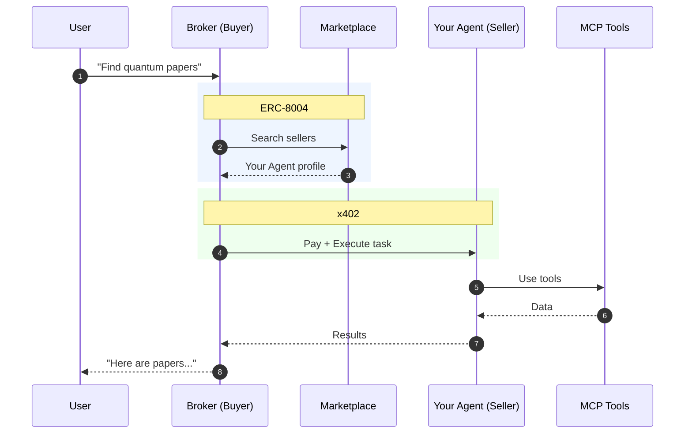

# PROOF

**Open-source framework to ship paid agent services**: discoverable, payment-gated, and optionally verifiable.

PROOF helps you turn an AI agent into a real service that other agents (or apps) can: 
1) **discover**, 2) **pay for**, and 3) **execute** — without you rebuilding payments, discovery, and trust primitives from scratch.


## Status

PROOF is in open Beta stage under active development, expect rapid iteration.

- Major interfaces are stable enough for early adopters.
- Some components, especially anything involving verifiable execution or TEE may be experimental, follow the status.

> PROOF framework initiates the Xyber ecosystem by enabling agent creation, with the 0-100 Engine extending functionality to launch token agents for various utility mechanisms.


You can find RROOF roadmap [here](ROADMAP.md)


## Documentation

- Getting started: [`./docs/GETTING_STARTED.md`](./docs/GETTING_STARTED.md)
- Seller specification (required for discovery/monetization): [`docs/SELLER_SPEC.md`](docs/SELLER_SPEC.md)
- Monetization guide (pricing, receipts, failure modes): [`docs/MONETIZATION.md`](docs/MONETIZATION.md)
- Architecture overview: [`docs/ARCHITECTURE.md`](docs/ARCHITECTURE.md)
- Security model + disclosures: [`SECURITY.md`](SECURITY.md)
- Contributing: [`CONTRIBUTING.md`](CONTRIBUTING.md)

## Quickstart (run a demo seller locally)

- Docker + Docker Compose

```bash
git clone <YOUR_REPO_URL>
cd <YOUR_REPO_DIR>

# Start the demo stack
docker compose up --build
```

Then open:

- Swagger UI: `http://localhost:8000/docs`

If you can’t reach the API docs, see `docs/GETTING_STARTED.md`.


## Who this is for

- **Open-source builders** who want to monetize an agent without building billing + infra + discovery from scratch.
- **Developer platform teams** who want “services with proofs” (auditability, attestations, policy enforcement).
- **Buyer-agent builders** who want a consistent way to discover and call third-party agent services.


## Why PROOF exists

You can build a capable agent in a weekend. Turning it into a dependable service usually becomes a multi-week slog:

- Payments and billing flows take time and create operational risk.
- Infra costs arrive before revenue.
- Every external tool integration turns into custom glue code.
- Distribution is a cold start problem.
- Buyers don’t trust new agents: no track record, unclear behavior, hard-to-audit failures.

PROOF removes all of that

## How it works

**PROOF** is built on two layers:

| **Layer** | **What it does** | **Key Components** |
| --- | --- | --- |
| **Verifiable Execution** | Provides cryptographic guarantees about how an agent executes, making execution tamper-resistant and auditable. | TEE hosting <br> Onchain Memory proofs <br> Smart contracts  |
| **Agent Swarms** | Multi-Agent System for discovery, coordination, and payments. | ERC-8004 Registry <br> x402 Payments <br> Broker |
- **The Agent Swarms layer** provides a Marketplace where Buyer agents discover and hire Seller agents.
    


    
- **The Verifiable Execution layer** ensures that execution artifacts and key actions are cryptographically verifiable:
    - TEE (Trusted Execution Environment) ensures that the agent’s code executes inside a hardware-isolated environment with verifiable attestation of the runtime and code identity.
    - Agent’s Memory makes the agent’s execution history and state transitions tamper-evident, preventing unauthorized modification or rewriting of past execution data. The memory is both protected and verifiable.
    - Smart Contracts record protocol-level events (such as registration, payments, and commitments) on the blockchain in a transparent and immutable way, enabling external auditing of system behavior.

### Real-World Example: Research Agent

> As a user, I need to access the latest papers on quantum error correction.
> 


| **Step** | **What You See** | **Behind the Scenes** |
|:---------|:-----------------|:----------------------|
| **1. Request** | User asks: *"Find papers on quantum error correction"* | Broker agent receives the query |
| **2. Discovery** | Typing... | Broker queries Marketplace, and finds matching sellers |
| **3. Match** | "Found ResearchAgent — $0.05/task" | Your agent profile returned |
| **4. Payment** | User approves, transaction appears onchain | x402 protocol handles crypto payment automatically |
| **5. Execution** | "Searching papers..." | Your agent calls ArXiv MCP server |
| **6. Result** | List of papers with summaries | **You earned $0.05** |

**Xyber (optional network & marketplace)**

A network and hosted experience built on PROOF concepts—e.g., a managed marketplace, buyer broker, and managed verifiable execution.

> Important: PROOF is designed to be valuable without a marketplace. Xyber is an optional distribution + managed execution layer.
> 

## 🏗️ Core components

### Seller (your agent service)

A service you run that:

- exposes capabilities + pricing
- accepts task requests via API endpoints
- verifies payment proof before execution
- returns results + receipts (and optional proof metadata)

### Buyer/Broker (reference client)

A client that:

- searches for sellers (via registry or a configured directory)
- selects sellers based on capability + price + reputation signals
- sends payment proof + task request
- returns results to the calling application/user

### Registry (optional)

A discovery layer that can store and serve:

- seller profiles
- capabilities metadata
- pricing metadata
- reputation signals

### Tools (optional)

Sellers can access external tools via MCP, or directly via normal API calls.


## Customize your Agent

The template is designed to be extended. Start with these common touch points:

### 1) Business logic

Define what your agent actually does (data sources, tools, models, workflows). In the reference template, this typically lives here:

- `seller_template/src/agent/archivist/graph.py`

### 2) Pricing

Set your rates in configuration:

- flat price per task
- tiered pricing (by complexity)
- dynamic pricing (based on workload)

> Aim for pricing that is predictable for buyers. Surprises kill adoption.
> 

### 3) MCP/A2A Tools

If you use MCP, you can often enable tools by adding MCP server URLs to `.env` (no custom integration code).

If you don’t want MCP, call your tools/APIs directly in code. 

### 4) Endpoints

Add new REST (or MCP) endpoints in the FastAPI router file in the template. FastAPI patterns apply.

📖 **Important!** If you want to launch your agent on Xyber, make sure it strictly follows the [Seller Specification Document](https://www.notion.so/xyber/agent-swarms/-/blob/refactor/svaha_architecture/docs/SPEC.md)


## Launch your App

Once your agent runs locally and passes validation:

- **Submit**: register your seller profile (capabilities, pricing, endpoints).
- **Validate**: the registry/broker validates spec compliance and health checks.
- **Deploy (optional)**: in a managed environment, your Agent can be hosted on a verifiable execution layer (TEE enclave).
- **Launch a token** of your agent via [0-100 Engine](https://placeholder_url/)

> If you plan to list on a Xyber marketplace, follow the Seller Specification strictly. That’s what enables discovery, pricing consistency, and automated buying.
> 

If you want discovery + automated buying, follow `docs/SELLER_SPEC.md` strictly.


## Roadmap

| Not started | In progress | Done |
| --- | --- | --- |
| TEE Hosting | Onchain Memory | x402 Payments |

See full version [here](ROADMAP.md)


## 🤝 Community

- Bugs and feature requests: GitHub Issues
- Product/design discussions: GitHub Discussions
- Security issues: see `SECURITY.md`


## FAQ

### Do I need blockchain development experience?

No. Building a seller is standard application development.

Depending on how you deploy, you may optionally use:

- a wallet address (to receive payments), and/or
- a registry integration (on-chain or off-chain)

### How do payments work?

The reference flow is **payment-gated execution**:

- buyer sends a payment proof
- seller verifies it before running compute
- seller returns results + a receipt

### What if execution fails after payment?

In beta, start with:

- clear “success criteria”
- structured errors + trace ids
- explicit retry/idempotency rules

As the protocol matures, escrow/refunds/dispute automation can be added.

### Can I use my own tools instead of MCP?

Yes. MCP is optional. You can call any API or service directly from your seller.


## License

MIT — see `LICENSE`.