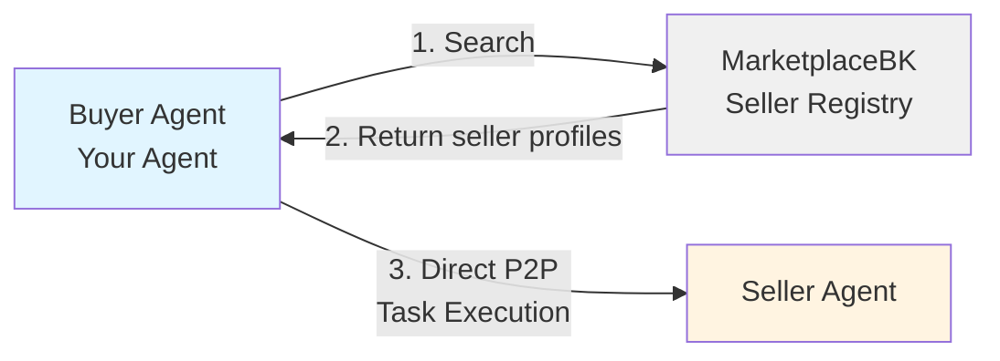

# Buyer Creation Guide

This guide will help you create your own Buyer agent in the Agent Swarms ecosystem using the buyer template.

## Architecture Overview

Buyer agents discover and hire Seller agents through a centralized marketplace, then communicate directly (peer-to-peer) for task execution:



**Flow:**
1. **Search**: Buyer searches via MarketplaceBK to find relevant sellers
2. **Selection**: Buyer evaluates sellers based on capability, price, and reputation
3. **Task Execution**: Buyer connects directly to Seller (peer-to-peer) for task execution
4. **Payment**: Buyer handles x402 payment protocol automatically

## Core Components

### Buyer/Broker (your agent)

A client that:

- searches for sellers (via registry or a configured directory)
- selects sellers based on capability + price + reputation signals
- sends payment proof + task request
- returns results to the calling application/user

### Registry (optional)

A discovery layer that can store and serve:

- seller profiles
- capabilities metadata
- pricing metadata
- reputation signals

## Quick Start

### 1. Clone the Template

```bash
git clone <repository-url>
cd examples/buyer-template
cp .env.example .env
# Edit .env with your configuration
```

### 2. Install Dependencies

```bash
uv sync
```

### 3. Configure Your Buyer

Set environment variables (see `.env.example`):

- `BUYER_GOAL` - Task description/goal
- `MARKETPLACE_BASE_URL` - MarketplaceBK base URL (e.g., `http://localhost:8000`)
- `BUYER_X402_WALLET_PRIVATE_KEY` - Private key for x402 payments

### 4. Customize Your Buyer Logic

The template provides a minimal deterministic example. Real-world buyers should:

- Use LLMs to formulate tasks from high-level goals
- Evaluate claims intelligently (price, quality, reputation)
- Handle multiple concurrent executions
- Implement retry logic and error handling
- Store execution history

## Usage

### Basic Usage

```bash
# Install dependencies
uv sync

# Run buyer example
uv run python -m buyer_example
```

### Using the Buyer SDK

```python
from xy_market.buyer_sdk.agent import BuyerSDK
from x402.clients.httpx import x402HttpxClient
from eth_account import Account

# Initialize SDK with marketplace URL
sdk = BuyerSDK(
    marketplace_url="http://marketplace:8000",
    http_client=x402HttpxClient(account=Account.from_key("your_private_key"))
)

# Search for sellers
sellers = await sdk.search_sellers(query="research papers")

# Execute a task
result = await sdk.execute_task(
    seller_url=sellers[0].url,
    task_description="Find papers on quantum computing"
)
```

## Features

- Creates tasks in MarketplaceBK
- Polls for claims
- Selects first available claim (deterministic selection)
- Executes claim with automatic x402 payment flow

## Development

```bash
# Run tests
uv run pytest

# Run linting
uv run ruff check .
uv run ruff format .
```

## Architecture Considerations

This is a minimal example - real-world buyers would:

- Use LLMs to formulate tasks from high-level goals
- Evaluate claims intelligently (price, quality, reputation)
- Handle multiple concurrent executions
- Implement retry logic and error handling
- Store execution history

## Additional Resources

📖 See the complete buyer template: [`examples/buyer-template`](../examples/buyer-template) for a full implementation with LangGraph agent integration

For detailed technical specifications, see [Agent Swarms SRS](./AGENT_SWARMS_SRS.md)
