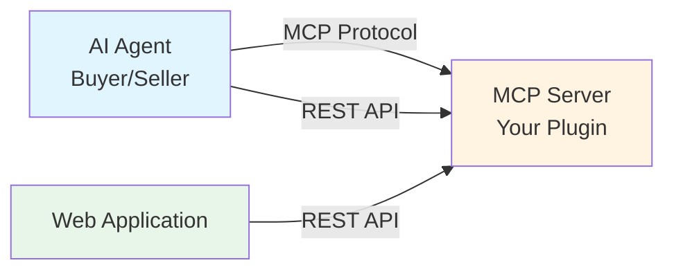

# MCP Plugin Creation Guide

This guide will help you create your own MCP (Model Context Protocol) server plugin using the MCP server template.

## Architecture Overview

MCP servers provide tools and capabilities that can be used by AI agents. They follow a **hybrid architecture** that exposes functionality through REST APIs, MCP, or both simultaneously.



**Capabilities:**

1. **API-Only Endpoints** (`/api`) - Standard REST endpoints for traditional clients
2. **Hybrid Endpoints** (`/hybrid`) - Accessible via both REST and as MCP tools
3. **MCP-Only Endpoints** - Tools exposed exclusively to AI agents

## Quick Start

### 1. Clone the Template

```bash
git clone <repository-url>
cd examples/mcp-server-template
cp .env.example .env
# Configure environment for x402, logging, etc. (see .env.example)
```

### 2. Install Dependencies

```bash
uv sync
```

### 3. Customize Your Plugin

1. **Update Configuration** (`config.py`)
   - Adjust environment variable prefixes
   - Configure payment settings (if using x402)
   - Set deployment parameters

2. **Add Your Endpoints**
   - **API-only**: Add to `api_routers/` for REST-only endpoints
   - **Hybrid**: Add to `hybrid_routers/` for REST+MCP endpoints
   - **MCP-only**: Add to `mcp_routers/` for AI agent tools

3. **Implement Business Logic** (`weather/` directory structure)
   - Create your domain module (e.g., `weather/`, `arxiv/`, `database/`)
   - Implement core functionality
   - Add error handling

4. **Configure Payment** (Optional)
   - Set `operation_id` on paid endpoints
   - Add pricing entries in `tool_pricing.yaml`
   - Enable x402 middleware in `.env`

## Running the Server

### Locally

```bash
# Basic run
uv run python -m mcp_server_weather

# Or with custom port and host
uv run python -m mcp_server_weather --port 8000 --reload
```

### Using Docker

```bash
# Build the image
docker build -t mcp-server-weather .

# Run the container
docker run --rm -it -p 8000:8000 --env-file .env mcp-server-weather
```

### Using Docker Compose

From the root directory:

```bash
# Run the production container
docker compose up mcp-server-weather

# Run the development container with hot-reloading
docker compose -f docker-compose.debug.yml up mcp_server_weather
```

## API Documentation

This server automatically generates OpenAPI documentation. Once the server is running, you can access:

- **Swagger UI**: [http://localhost:8000/docs](http://localhost:8000/docs) (for REST endpoints)
- **MCP Inspector**: Use an MCP-compatible client to view available agent tools [http://localhost:8000/mcp](http://localhost:8000/mcp)

## Project Structure

```
mcp-server-template/
├── src/
│   └── mcp_server_weather/
│       ├── __init__.py
│       ├── __main__.py              # Entry point (CLI + uvicorn)
│       ├── app.py                   # Application factory & lifespan
│       ├── config.py                # Settings with lru_cache factories
│       ├── logging_config.py        # Logging configuration
│       ├── dependencies.py          # FastAPI dependency injection
│       ├── schemas.py               # Pydantic request/response models
│       │
│       ├── api_routers/             # API-Only endpoints (REST)
│       ├── hybrid_routers/          # Hybrid endpoints (REST + MCP)
│       ├── mcp_routers/             # MCP-Only endpoints
│       ├── middlewares/
│       │   └── x402.py              # x402 payment middleware
│       │
│       └── weather/                 # Business logic layer
│           ├── __init__.py
│           ├── config.py
│           ├── models.py
│           ├── module.py
│           └── errors.py
│
├── tests/
├── .env.example
├── Dockerfile
├── pyproject.toml
└── README.md
```

## Testing

```bash
# Run all tests
uv run pytest

# Run with verbose output
uv run pytest -v
```

## Payment Integration (Optional)

If you want to charge for your MCP tools:

1. **Set operation_id** on paid endpoints:
   ```python
   @router.post(
       "/your-endpoint",
       operation_id="your_operation_id",
   )
   ```

2. **Add pricing** in `tool_pricing.yaml`:
   ```yaml
   your_operation_id:
     - token_amount: 1000
       chain_id: 8453
       token_address: "0x833589fCD6eDb6E08f4c7C32D4f71b54bdA02913"
   ```

3. **Enable x402 middleware** in `.env`:
   ```bash
   MCP_SERVER_WEATHER_X402_PRICING_MODE=on
   MCP_SERVER_WEATHER_X402_PAYEE_WALLET_ADDRESS=0x...
   ```

## Example: API Key Usage

For endpoints that require external API keys (e.g., OpenWeatherMap), you can support both:

### Method 1: Request Header (Multi-Tenant)

Clients provide API key via header:

```bash
curl -X POST http://localhost:8000/hybrid/current \
  -H "Weather-Api-Key: your-api-key" \
  -H "Content-Type: application/json" \
  -d '{"latitude": "51.5074", "longitude": "-0.1278"}'
```

### Method 2: Server-Side Configuration (Single-Tenant)

Set default API key in `.env`:

```bash
WEATHER_API_KEY=your-api-key
```

## Additional Resources

📖 See the complete MCP server template: [`examples/mcp-server-template`](../examples/mcp-server-template) for a full implementation

For detailed technical specifications, see [Agent Swarms SRS](./AGENT_SWARMS_SRS.md)
